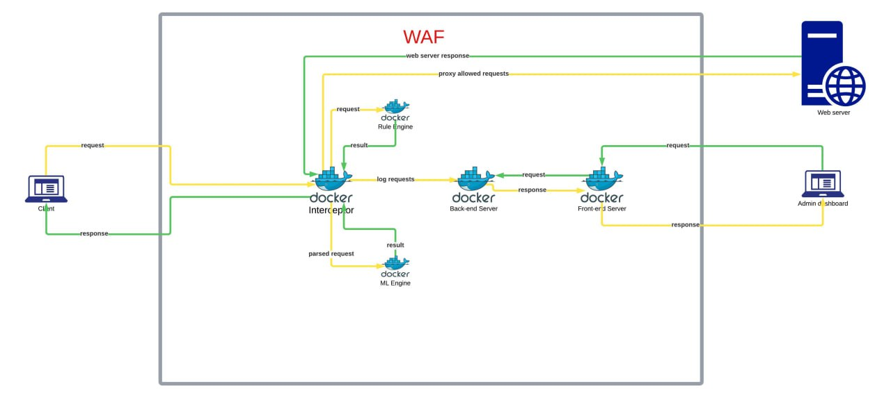

# GASHA WAF - Built to Evolve, Designed to Protect


## Overview

**GASHA WAF** is an AI-powered Web Application Firewall engineered to protect modern web applications from evolving cyber threats, especially **injection-based attacks** like SQLi, XSS, and more. It fuses rule-based security with machine learning models to detect and mitigate threats in real time.

This project was developed as a final capstone submission for the Software Engineering Program at AAiT.

## 🚀 Features

* **AI-Driven Threat Detection**: Inline detection using fusion of RF (request classification) and DT (attack classification).
* **Online Learning**: Continual update and adjustment to new traffic patterns.
* **Custom Rule Engine**: Add custom WAF rules per application.
* **Rate Limiting**: Stop brute-force and DoS-style attacks.
* **Real-Time Logging & Dashboard**: Centralized logs and statistics via frontend.
* **Notification System**: Email and dashboard-based alerts for critical events.

## 🧠 Architecture

GASHA WAF consists of multiple microservices:

* **Interceptor**: Captures and forwards HTTP requests.
* **ML Server**: Classifies traffic and detects anomalies.
* **Backend API**: Core WAF engine and configuration service.
* **Frontend Dashboard**: Visualization, rule management, and alert configuration.



---

## 📦 Tech Stack

* **Backend**: Go (Gin Framework)
* **Machine Learning**: Python (Random Forest & Decision Tree)
* **Database**: PostgreSQL
* **Frontend**: React + Vite
* **Infrastructure**: Docker, GitHub Actions

---

## 🐳 Installation (Docker-Based)

### Prerequisites

* Docker & Docker Compose installed

### Step-by-Step

1. Pull the images:

```bash
docker pull natnaelcrypto/ml
docker pull natnaelcrypto/waf-db
docker pull natnaelcrypto/waf-backend
docker pull natnaelcrypto/interceptor
docker pull natnaelcrypto/waf-frontend
```

2. Run the containers in order:

   * `waf-db`
   * `waf-backend`
   * `interceptor`
   * `ml`
   * `frontend`

---

## 🔧 Environment Variables

### Backend

```
DB_HOST=pg-xxxx.aivencloud.com
DB_PORT=25211
DB_USER=avnadmin
DB_PASSWORD=***
DB_NAME=waf
DB_SSLMODE=require
WSKEY=***
JWT_SECRET_KEY=***
```

### Frontend

```
VITE_BACKEND_URL=https://waf-backend-latest.onrender.com
```

### Interceptor

```
BACKENDURL=https://waf-backend-latest.onrender.com
MLHOSTURL=https://ml-oqqe.onrender.com
CAPTCHA_SECRET=***
WSKEY=***
```

### ML Service

```
# General App Settings
DEBUG=True

# BACKEND API Endpoints
BACKEND_API_URL =http://localhost:8484/
BACKEND_API_ML_MODELS_PATH=ml/models
BACKEND_API_TYPE_ANALYSIS_PATH=ml/submit-analysis

# Model Paths
ANOMALY_PREDICTOR_MODEL_PATH=ml_models/random_forest_model_v.0.1.5.pkl
TYPE_PREDICTOR_MODEL_PATH=ml_models/type_predictor_rf.joblib

# Badword Paths
BAD_WORDS_BY_TYPE_DIR = ./words/words_by_type/
COMMON_BAD_WORDS_PATH = ./words/bad_words.txt

```

---

## 🛡️ Detection Capabilities

* SQL Injection
* Cross-Site Scripting (XSS)
* Command Injection
* Code Injection
* LDAP Injection
* XML Injection
* Rate-based attacks (via built-in rate limiter)

All attacks are **logged**, **classified**, and **blocked** in real-time.

---

## 📊 Dashboard & Analytics

* **Comprehensive stats dashboard** for:

  * Traffic volume
  * Attack types
  * Request origins
  * Model vs Rule-based detections
  * Notifications & alert settings


---

## 🧪 CI/CD & Testing

* CI/CD managed through GitHub Actions.
* Automated testing pipeline ensures deployment safety.

---

## 📄 License

Licensed under the [Apache License 2.0](LICENSE).

---

## 👨‍💻 Maintainers

**Natnael Yohannes**

* Email: [yohannesnatanel9@gmail.com](mailto:yohannesnatanel9@gmail.com)
* GitHub: [@Natnael-crypto](https://github.com/Natnael-crypto)
* LinkedIn: [Natnael Yohannes Gesiab](https://www.linkedin.com/in/natnael-yohannes-gesiab/)
